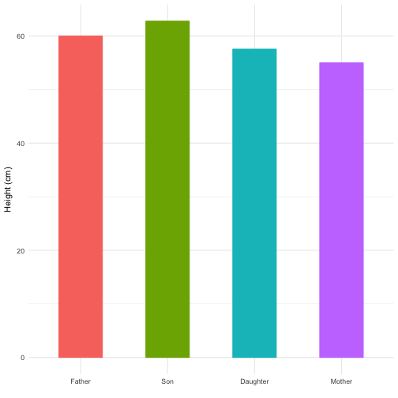

Predict son-daughter height from parents
========================================================
author: giu87
date: 20/11/2016

Overview
========================================================

The data used for the application belongs to the GaltonFamilies data set, from the HistData R package.

The main target of the application is to predict the height of the child of two parents. Given the height of the mother and the father (input values), predict the height of a son and a daughter.

Given the two input heights, the application provide a visual representation of what the height of two potential childs wuold be.

Building the model
========================================================

The model will be based on the father and mother's heights and the gender of the child.


```r
gf <- GaltonFamilies
model <- lm(childHeight ~ father + mother + gender, data=gf)

model$coefficients
```

```
(Intercept)      father      mother  gendermale 
 16.5212399   0.3928433   0.3176101   5.2149894 
```

Plotting the data
========================================================

Once the model is created, we can expose a function which reads the input, predicts the height of the son and daughter and plot the results. 

Here an example with father's height of 60" and mother's height of 55":



Where to find the application
========================================================
- The application can be found at https://giu87.shinyapps.io/DevelopingDataProdictsProject
- GitHub repo containig the application code: https://github.com/giu87/datasciencecoursera/tree/master/developingDataProducts/project
